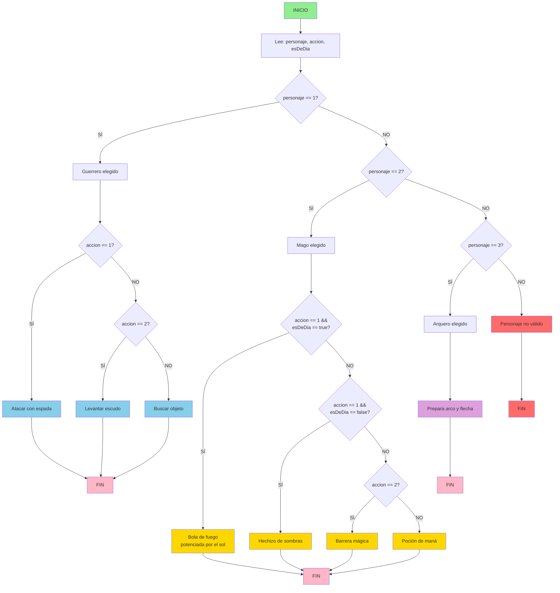

# Tarea 2: Codigo 1 Definición Pruebas - MenuVideojuego

## 📋 Introducción

Este documento presenta el análisis de calidad del código Java `MenuVideojuego.java`, que implementa un sistema de menú para un juego de aventura basado en la selección de personaje y acciones.

---

## 1️⃣ Verificación de Ejecución

### ✅ El código se ejecuta correctamente

El programa:
- ✅ Compila sin errores
- ✅ Se ejecuta correctamente con entradas válidas
- ✅ Maneja adecuadamente los datos de entrada (Scanner)
- ✅ Cierra correctamente el Scanner con `.close()`

**Conclusión**: A priori no se requieren correcciones en la ejecución.

---

## 2️⃣ Pruebas del Camino Básico

### 📌 Grafo de Flujo del Método  
Como el grafo no cabía del todo en la imagen, después de haber estado investigando lo he representado directamente aquí utilizando **Mermaid**.

### 🎥 Vídeo explicativo (Muy recomendado)  
Buscando cómo representarlo dí con este vídeo que lo explica todo super bien y de una forma bastante entendible:

👉 [Enlace al vídeo explicativo](https://youtu.be/E9mQzJImeNQ?si=43h7bwJ0JvA1FQpN)



### Identificación de Líneas de Código

| Línea | Decisión | Tipo |
|-------|----------|------|
| if (personaje == 1) | Comparación simple | +1 |
| if (accion == 1) | Comparación simple | +1 |
| else if (accion == 2) | Comparación simple | +1 |
| else if (personaje == 2) | Comparación simple | +1 |
| if (accion == 1 && esDeDia) | AND lógico | +2 |
| else if (accion == 1 && !esDeDia) | AND + NOT lógico | +2 |
| else if (accion == 2) | Comparación simple | +1 |
| else if (personaje == 3) | Comparación simple | +1 |
| else | Captura de error | +1 |

---

## 3️⃣ Complejidad Ciclomática

### Cálculo de Complejidad Ciclomática (CC)

**Fórmula**: CC = E - N + 2P

Donde:
- E = Aristas (ramas)
- N = Nodos (puntos de decisión)
- P = Componentes conexos

### Conteo de Decisiones

| Tipo | Cantidad | Detalles |
|------|----------|----------|
| if (personaje == 1) | +1 | Primer nivel |
| if (accion == 1) dentro Guerrero | +1 | Segundo nivel |
| else if (accion == 2) dentro Guerrero | +1 | Alternativa |
| else if (personaje == 2) | +1 | Primer nivel |
| if (accion == 1 && esDeDia) dentro Mago | +2 | AND cuenta como 2 |
| else if (accion == 1 && !esDeDia) dentro Mago | +2 | AND + NOT |
| else if (accion == 2) dentro Mago | +1 | Alternativa |
| else if (personaje == 3) | +1 | Primer nivel |
| else | +1 | Captura de error |
| **TOTAL** | **11** | |

### Resultado

```
CC = 11 (Complejidad Ciclomática)
```

**Requisito de la empresa**: CC < 9  
**Resultado obtenido**: CC = 11  
**POR LO QUE NO CUMPLE CON EL REQUISITO**

**Conclusión**: El código **EXCEDE** la complejidad máxima permitida por la empresa en **2 puntos**.

### Justificación del Incumplimiento

El código tiene una complejidad ciclomática elevada debido a:

1. **Múltiples decisiones anidadas** en la estructura if-else if
2. **Operadores lógicos complejos** (AND, NOT) que incrementan la CC
3. **Falta de refactorización** para reducir caminos independientes
4. **Estructura monolítica** sin separación de responsabilidades

Para cumplir el requisito (CC < 9), habría que:

1. **Usar Switch en lugar de if-else if** para personaje
2. **Crear métodos separados** para cada personaje (ej: `atacarGuerrero()`, `atacarMago()`)
3. **Extraer condiciones complejas** a métodos booleanos
4. **Aplicar patrón Strategy** para las acciones

---

## 4️⃣ Conjunto Básico de Caminos Independientes

Los 9 caminos básicos son:

| # | Entrada | Acción | esDeDia | Salida |
|---|---------|--------|---------|--------|
| 1 | personaje=1 | accion=1 | true/false | Guerrero ataca |
| 2 | personaje=1 | accion=2 | true/false | Guerrero defiende |
| 3 | personaje=1 | accion=3 | true/false | Guerrero usa objeto |
| 4 | personaje=2 | accion=1 | true | Mago atacar (día) |
| 5 | personaje=2 | accion=1 | false | Mago atacar (noche) |
| 6 | personaje=2 | accion=2 | true/false | Mago defiende |
| 7 | personaje=2 | accion=3 | true/false | Mago usa objeto |
| 8 | personaje=3 | accion=1/2/3 | true/false | Arquero cualquier acción |
| 9 | personaje=0/4+ | accion=1/2/3 | true/false | Personaje inválido |

---

## 5️⃣ Particiones de Equivalencia con Valores Límite

### Variable: personaje (int)

| Partición | Rango | Valores Límite | Clase | Válida |
|-----------|-------|----------------|-------|--------|
| Válida 1 | 1 | 1 | Guerrero | ✅ |
| Válida 2 | 2 | 2 | Mago | ✅ |
| Válida 3 | 3 | 3 | Arquero | ✅ |
| Inválida Baja | < 1 | 0, -1 | No existe | ❌ |
| Inválida Alta | > 3 | 4, 5, 100 | No existe | ❌ |

### Variable: accion (int)

| Partición | Rango | Valores Límite | Clase | Válida |
|-----------|-------|----------------|-------|--------|
| Válida 1 | 1 | 1 | Atacar | ✅ |
| Válida 2 | 2 | 2 | Defender | ✅ |
| Válida 3 | 3 | 3 | Usar objeto | ✅ |
| Inválida Baja | < 1 | 0, -1 | No existe | ❌ |
| Inválida Alta | > 3 | 4, 5, 100 | No existe | ❌ |

### Variable: esDeDia (boolean)

| Partición | Valores | Clase | Válida |
|-----------|---------|-------|--------|
| Válida Verdadero | true | Es de día | ✅ |
| Válida Falso | false | Es de noche | ✅ |

---

## 6️⃣ Casos de Prueba

### TC-01: Guerrero Ataca

| Campo | Valor |
|-------|-------|
| **ID** | TC-01 |
| **Descripción** | Seleccionar Guerrero y acción Atacar |
| **Precondiciones** | Programa ejecutándose, esperando entrada |
| **Entrada** | personaje=1, accion=1, esDeDia=true |
| **Pasos** | 1. Ingresar 1 para Guerrero<br>2. Ingresar 1 para Atacar<br>3. Ingresar true para día |
| **Salida Esperada** | "¡El Guerrero ataca con su espada!" |
| **Criterios de Aceptación** | El mensaje aparece exactamente como se especifica |
| **Partición** | Válida (Personaje 1, Acción 1) |

### TC-02: Guerrero Defiende

| Campo | Valor |
|-------|-------|
| **ID** | TC-02 |
| **Descripción** | Seleccionar Guerrero y acción Defender |
| **Precondiciones** | Programa ejecutándose, esperando entrada |
| **Entrada** | personaje=1, accion=2, esDeDia=false |
| **Pasos** | 1. Ingresar 1 para Guerrero<br>2. Ingresar 2 para Defender<br>3. Ingresar false para noche |
| **Salida Esperada** | "El Guerrero levanta su escudo para defenderse." |
| **Criterios de Aceptación** | El mensaje aparece exactamente como se especifica |
| **Partición** | Válida (Personaje 1, Acción 2) |

### TC-03: Guerrero Usa Objeto

| Campo | Valor |
|-------|-------|
| **ID** | TC-03 |
| **Descripción** | Seleccionar Guerrero y acción Usar Objeto |
| **Precondiciones** | Programa ejecutándose, esperando entrada |
| **Entrada** | personaje=1, accion=3, esDeDia=true |
| **Pasos** | 1. Ingresar 1 para Guerrero<br>2. Ingresar 3 para Usar Objeto<br>3. Ingresar true para día |
| **Salida Esperada** | "El Guerrero busca en su mochila un objeto útil." |
| **Criterios de Aceptación** | El mensaje aparece exactamente como se especifica |
| **Partición** | Válida (Personaje 1, Acción 3) |

### TC-04: Mago Ataca de Día

| Campo | Valor |
|-------|-------|
| **ID** | TC-04 |
| **Descripción** | Seleccionar Mago, acción Atacar y es de día |
| **Precondiciones** | Programa ejecutándose, esperando entrada |
| **Entrada** | personaje=2, accion=1, esDeDia=true |
| **Pasos** | 1. Ingresar 2 para Mago<br>2. Ingresar 1 para Atacar<br>3. Ingresar true para día |
| **Salida Esperada** | "El Mago lanza una bola de fuego potenciada por el sol." |
| **Criterios de Aceptación** | El mensaje aparece exactamente como se especifica |
| **Partición** | Válida (Personaje 2, Acción 1, esDeDia=true) |

### TC-05: Mago Ataca de Noche

| Campo | Valor |
|-------|-------|
| **ID** | TC-05 |
| **Descripción** | Seleccionar Mago, acción Atacar y es de noche |
| **Precondiciones** | Programa ejecutándose, esperando entrada |
| **Entrada** | personaje=2, accion=1, esDeDia=false |
| **Pasos** | 1. Ingresar 2 para Mago<br>2. Ingresar 1 para Atacar<br>3. Ingresar false para noche |
| **Salida Esperada** | "El Mago invoca un hechizo de sombras." |
| **Criterios de Aceptación** | El mensaje aparece exactamente como se especifica |
| **Partición** | Válida (Personaje 2, Acción 1, esDeDia=false) |

### TC-06: Mago Defiende

| Campo | Valor |
|-------|-------|
| **ID** | TC-06 |
| **Descripción** | Seleccionar Mago y acción Defender |
| **Precondiciones** | Programa ejecutándose, esperando entrada |
| **Entrada** | personaje=2, accion=2, esDeDia=true |
| **Pasos** | 1. Ingresar 2 para Mago<br>2. Ingresar 2 para Defender<br>3. Ingresar true para día |
| **Salida Esperada** | "El Mago crea una barrera mágica." |
| **Criterios de Aceptación** | El mensaje aparece exactamente como se especifica |
| **Partición** | Válida (Personaje 2, Acción 2) |

### TC-07: Mago Usa Objeto

| Campo | Valor |
|-------|-------|
| **ID** | TC-07 |
| **Descripción** | Seleccionar Mago y acción Usar Objeto |
| **Precondiciones** | Programa ejecutándose, esperando entrada |
| **Entrada** | personaje=2, accion=3, esDeDia=false |
| **Pasos** | 1. Ingresar 2 para Mago<br>2. Ingresar 3 para Usar Objeto<br>3. Ingresar false para noche |
| **Salida Esperada** | "El Mago bebe una poción de maná." |
| **Criterios de Aceptación** | El mensaje aparece exactamente como se especifica |
| **Partición** | Válida (Personaje 2, Acción 3) |

### TC-08: Arquero (Cualquier acción)

| Campo | Valor |
|-------|-------|
| **ID** | TC-08 |
| **Descripción** | Seleccionar Arquero con cualquier acción |
| **Precondiciones** | Programa ejecutándose, esperando entrada |
| **Entrada** | personaje=3, accion=1, esDeDia=true |
| **Pasos** | 1. Ingresar 3 para Arquero<br>2. Ingresar 1 para Atacar<br>3. Ingresar true para día |
| **Salida Esperada** | "El Arquero prepara su arco y flecha." |
| **Criterios de Aceptación** | El mensaje aparece exactamente como se especifica |
| **Partición** | Válida (Personaje 3) |

### TC-09: Personaje Inválido (Límite Bajo)

| Campo | Valor |
|-------|-------|
| **ID** | TC-09 |
| **Descripción** | Seleccionar personaje fuera de rango (< 1) |
| **Precondiciones** | Programa ejecutándose, esperando entrada |
| **Entrada** | personaje=0, accion=1, esDeDia=true |
| **Pasos** | 1. Ingresar 0 para personaje inválido<br>2. Ingresar 1 para Atacar<br>3. Ingresar true para día |
| **Salida Esperada** | "Personaje no válido. Fin del juego." |
| **Criterios de Aceptación** | El mensaje aparece exactamente como se especifica |
| **Partición** | Inválida (< 1) |

### TC-10: Personaje Inválido (Límite Alto)

| Campo | Valor |
|-------|-------|
| **ID** | TC-10 |
| **Descripción** | Seleccionar personaje fuera de rango (> 3) |
| **Precondiciones** | Programa ejecutándose, esperando entrada |
| **Entrada** | personaje=4, accion=1, esDeDia=true |
| **Pasos** | 1. Ingresar 4 para personaje inválido<br>2. Ingresar 1 para Atacar<br>3. Ingresar true para día |
| **Salida Esperada** | "Personaje no válido. Fin del juego." |
| **Criterios de Aceptación** | El mensaje aparece exactamente como se especifica |
| **Partición** | Inválida (> 3) |

### TC-11: Acción Inválida (Límite Bajo)

| Campo | Valor |
|-------|-------|
| **ID** | TC-11 |
| **Descripción** | Seleccionar acción fuera de rango (< 1) con Guerrero |
| **Precondiciones** | Programa ejecutándose, esperando entrada |
| **Entrada** | personaje=1, accion=0, esDeDia=true |
| **Pasos** | 1. Ingresar 1 para Guerrero<br>2. Ingresar 0 para acción inválida<br>3. Ingresar true para día |
| **Salida Esperada** | "El Guerrero busca en su mochila un objeto útil." (capturado por else) |
| **Criterios de Aceptación** | Ejecuta el camino else sin error |
| **Partición** | Inválida (< 1) pero capturada por else |

### TC-12: Acción Inválida (Límite Alto)

| Campo | Valor |
|-------|-------|
| **ID** | TC-12 |
| **Descripción** | Seleccionar acción fuera de rango (> 3) con Guerrero |
| **Precondiciones** | Programa ejecutándose, esperando entrada |
| **Entrada** | personaje=1, accion=4, esDeDia=true |
| **Pasos** | 1. Ingresar 1 para Guerrero<br>2. Ingresar 4 para acción inválida<br>3. Ingresar true para día |
| **Salida Esperada** | "El Guerrero busca en su mochila un objeto útil." (capturado por else) |
| **Criterios de Aceptación** | Ejecuta el camino else sin error |
| **Partición** | Inválida (> 3) pero capturada por else |

---

## 📊 Resumen

| Elemento | Cantidad | Estado |
|----------|----------|--------|
| Decisiones Identificadas | 11 | ⚠️ |
| Caminos Básicos | 9 | ✅ |
| **Complejidad Ciclomática** | **11** | **❌ NO CUMPLE (Req: < 9)** |
| Casos de Prueba | 12 | ✅ |
| Particiones de Equivalencia | 10 | ✅ |