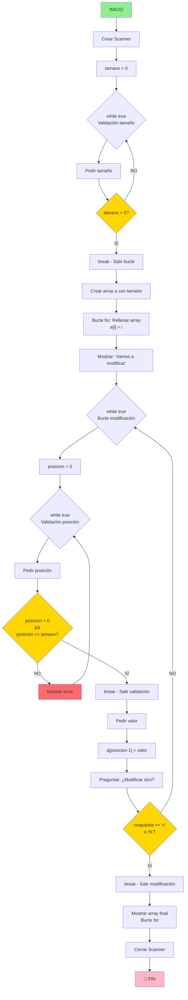

# Tarea 3: Codigo 2 Definición Pruebas - ModificarArraySimple

## 📋 Introducción

Este documento presenta el análisis de calidad del código Java `ModificarArraySimple.java`, que implementa un sistema para crear y modificar arrays dinámicamente mediante entrada del usuario.

**Requisito de la empresa**: La complejidad ciclomática debe ser menor que 9.

---

## 1️⃣ Verificación de Ejecución

### ✅ El código se ejecuta correctamente

El programa:
- ✅ Compila sin errores
- ✅ Se ejecuta correctamente con entradas válidas
- ✅ Maneja adecuadamente los datos de entrada (Scanner)
- ✅ Valida correctamente las posiciones del array (1 a tamaño)
- ✅ Cierra correctamente el Scanner con `.close()`

**Conclusión**: El código se ejecuta correctamente.

---

## 2️⃣ Pruebas del Camino Básico

### 📌 Grafo de Flujo del Método



### Identificación de Líneas de Código con Decisiones

| Línea | Código | Tipo de Decisión | CC |
|-------|--------|------------------|-----|
| while (true) | Bucle tamaño | Bucle infinito | +1 |
| if (tamano > 0) | Validación tamaño | Condición simple | +1 |
| while (true) | Bucle modificación principal | Bucle infinito | +1 |
| while (true) | Bucle validación posición | Bucle infinito | +1 |
| if (posicion > 0 && posicion <= tamano) | Validación posición | AND lógico | +2 |
| if (respuesta.equalsIgnoreCase("n")) | Validación continuar | Condición simple | +1 |

---

## 3️⃣ Complejidad Ciclomática

### Cálculo de Complejidad Ciclomática (CC)

**Fórmula**: CC = E - N + 2P

Donde:
- E = Aristas (ramas)
- N = Nodos (puntos de decisión)
- P = Componentes conexos

### Conteo de Decisiones

| Decisión | Línea Aproximada | CC Aportado |
|----------|------------------|-------------|
| while (true) #1 - Validación tamaño | ~13 | +1 |
| if (tamano > 0) | ~16 | +1 |
| while (true) #2 - Bucle modificación | ~31 | +1 |
| while (true) #3 - Validación posición | ~36 | +1 |
| if (posicion > 0 && posicion <= tamano) | ~41 | +2 |
| if (respuesta.equalsIgnoreCase("n")) | ~56 | +1 |
| **TOTAL** | | **7** |

### Resultado

- 3 bucles `while(true)`: +3
- 1 condición simple `if (tamano > 0)`: +1
- 1 condición compuesta `if (posicion > 0 && posicion <= tamano)`: +2 (por el AND)
- 1 condición simple `if (respuesta.equalsIgnoreCase("n"))`: +1

```
CC = 7 (Complejidad Ciclomática)
```

**Requisito de la empresa**: CC < 9  
**Resultado obtenido**: CC = 7  
**POR LO QUE CUMPLE CON EL REQUISITO**

**Conclusión**: El código **CUMPLE** perfectamente con la complejidad máxima permitida por la empresa.

### Justificación del Cumplimiento

El código tiene una complejidad ciclomática aceptable gracias a:

1. **Estructura organizada** en 3 bloques claros (crear, modificar, mostrar)
2. **Bucles de validación simples** sin anidación excesiva
3. **Condiciones claras** y bien definidas
4. **No hay decisiones innecesarias** o redundantes
5. **Lógica directa** sin operadores lógicos complejos en exceso

---

## 4️⃣ Conjunto Básico de Caminos Independientes

Los **7 caminos independientes** identificados son:

| # | Descripción del Camino | Entrada Ejemplo |
|---|------------------------|-----------------|
| 1 | Usuario ingresa tamaño inválido (<=0) → vuelve a pedir | tamano = -5, luego 5 |
| 2 | Usuario ingresa tamaño válido (>0) → crea array | tamano = 5 |
| 3 | Usuario ingresa posición inválida (fuera de rango) → vuelve a pedir | posicion = 0 o 10 (con tamano=5) |
| 4 | Usuario ingresa posición válida (1 a tamano) → modifica valor | posicion = 3, valor = 99 |
| 5 | Usuario decide continuar modificando ('s' o 'S') → vuelve al bucle | respuesta = "s" |
| 6 | Usuario decide NO continuar ('n' o 'N') → termina modificación | respuesta = "n" |
| 7 | Mostrar array final y cerrar programa | (siempre se ejecuta al final) |

---

## 5️⃣ Particiones de Equivalencia con Valores Límite

### Variable: tamano (int)

| Partición | Rango | Valores Límite | Clase | Válida |
|-----------|-------|----------------|-------|--------|
| Inválida Baja | <= 0 | -100, -1, 0 | Error - rechazado | ❌ |
| Válida Baja | 1 | 1 | Array mínimo | ✅ |
| Válida Media | 2-999 | 5, 10, 100 | Array normal | ✅ |
| Válida Alta | 1000+ | 1000, 10000 | Array grande | ✅ |

### Variable: posicion (int) - Depende de tamano

**Para tamano = 5 (ejemplo):**

| Partición | Rango | Valores Límite | Clase | Válida |
|-----------|-------|----------------|-------|--------|
| Inválida Baja | <= 0 | -5, 0 | Fuera de rango | ❌ |
| Válida Límite Inferior | 1 | 1 | Primera posición | ✅ |
| Válida Media | 2 a tamano-1 | 2, 3, 4 | Posiciones intermedias | ✅ |
| Válida Límite Superior | tamano | 5 | Última posición | ✅ |
| Inválida Alta | > tamano | 6, 10, 100 | Fuera de rango | ❌ |

### Variable: valor (int)

| Partición | Rango | Valores Límite | Clase | Válida |
|-----------|-------|----------------|-------|--------|
| Válido Negativo | -2147483648 a -1 | -100, -1 | Entero negativo | ✅ |
| Válido Cero | 0 | 0 | Cero | ✅ |
| Válido Positivo | 1 a 2147483647 | 1, 100, 9999 | Entero positivo | ✅ |

### Variable: respuesta (String)

| Partición | Valores | Clase | Válida |
|-----------|---------|-------|--------|
| Válida Continuar | "s", "S", cualquier texto != "n"/"N" | Continuar modificando | ✅ |
| Válida Terminar | "n", "N" | Terminar modificación | ✅ |

---

## 6️⃣ Casos de Prueba

### TC-01: Crear Array con Tamaño Inválido (0)

| Campo | Valor |
|-------|-------|
| **ID** | TC-01 |
| **Descripción** | Intentar crear array con tamaño 0 |
| **Precondiciones** | Programa ejecutándose, esperando entrada |
| **Entrada** | tamano = 0, luego tamano = 5 |
| **Pasos** | 1. Ingresar 0 como tamaño<br>2. Verificar que vuelve a pedir<br>3. Ingresar 5 como tamaño válido |
| **Salida Esperada** | Rechaza 0, vuelve a pedir, acepta 5 y crea array |
| **Criterios de Aceptación** | El programa no acepta 0 y no se bloquea |
| **Partición** | Inválida (tamano <= 0) |

### TC-02: Crear Array con Tamaño Negativo

| Campo | Valor |
|-------|-------|
| **ID** | TC-02 |
| **Descripción** | Intentar crear array con tamaño negativo |
| **Precondiciones** | Programa ejecutándose, esperando entrada |
| **Entrada** | tamano = -5, luego tamano = 3 |
| **Pasos** | 1. Ingresar -5 como tamaño<br>2. Verificar que vuelve a pedir<br>3. Ingresar 3 como tamaño válido |
| **Salida Esperada** | Rechaza -5, vuelve a pedir, acepta 3 y crea array |
| **Criterios de Aceptación** | El programa no acepta negativos y no se bloquea |
| **Partición** | Inválida (tamano < 0) |

### TC-03: Crear Array con Tamaño Mínimo (1)

| Campo | Valor |
|-------|-------|
| **ID** | TC-03 |
| **Descripción** | Crear array con tamaño mínimo válido |
| **Precondiciones** | Programa ejecutándose, esperando entrada |
| **Entrada** | tamano = 1 |
| **Pasos** | 1. Ingresar 1 como tamaño<br>2. Verificar que crea array de 1 elemento<br>3. Array debe contener [0] |
| **Salida Esperada** | Array creado correctamente con un elemento: a[1] = 0 |
| **Criterios de Aceptación** | Array de tamaño 1 creado sin errores |
| **Partición** | Válida (límite inferior) |

### TC-04: Crear Array con Tamaño Normal (5)

| Campo | Valor |
|-------|-------|
| **ID** | TC-04 |
| **Descripción** | Crear array con tamaño normal |
| **Precondiciones** | Programa ejecutándose, esperando entrada |
| **Entrada** | tamano = 5 |
| **Pasos** | 1. Ingresar 5 como tamaño<br>2. Verificar que crea array de 5 elementos<br>3. Array debe contener [0,1,2,3,4] |
| **Salida Esperada** | Array creado correctamente: a[1]=0, a[2]=1, a[3]=2, a[4]=3, a[5]=4 |
| **Criterios de Aceptación** | Array de tamaño 5 con valores consecutivos desde 0 |
| **Partición** | Válida (rango normal) |

### TC-05: Modificar Posición Inválida (0)

| Campo | Valor |
|-------|-------|
| **ID** | TC-05 |
| **Descripción** | Intentar modificar posición 0 (no existe) |
| **Precondiciones** | Array creado con tamano = 5 |
| **Entrada** | posicion = 0, luego posicion = 1, valor = 99 |
| **Pasos** | 1. Ingresar 0 como posición<br>2. Verificar mensaje de error<br>3. Ingresar 1 como posición válida<br>4. Ingresar 99 como valor |
| **Salida Esperada** | Rechaza 0, muestra error, acepta 1, modifica a[0] = 99 |
| **Criterios de Aceptación** | Muestra "Error: esa posición no existe." |
| **Partición** | Inválida (posicion <= 0) |

### TC-06: Modificar Posición Inválida (> tamano)

| Campo | Valor |
|-------|-------|
| **ID** | TC-06 |
| **Descripción** | Intentar modificar posición fuera del rango superior |
| **Precondiciones** | Array creado con tamano = 5 |
| **Entrada** | posicion = 6, luego posicion = 5, valor = 77 |
| **Pasos** | 1. Ingresar 6 como posición (fuera de rango)<br>2. Verificar mensaje de error<br>3. Ingresar 5 como posición válida<br>4. Ingresar 77 como valor |
| **Salida Esperada** | Rechaza 6, muestra error, acepta 5, modifica a[4] = 77 |
| **Criterios de Aceptación** | Muestra "Error: esa posición no existe." |
| **Partición** | Inválida (posicion > tamano) |

### TC-07: Modificar Primera Posición (1)

| Campo | Valor |
|-------|-------|
| **ID** | TC-07 |
| **Descripción** | Modificar la primera posición del array |
| **Precondiciones** | Array creado con tamano = 5 |
| **Entrada** | posicion = 1, valor = 100, respuesta = "n" |
| **Pasos** | 1. Ingresar 1 como posición<br>2. Ingresar 100 como valor<br>3. Ingresar "n" para no continuar |
| **Salida Esperada** | a[0] = 100 (mostrado como a[1] = 100) |
| **Criterios de Aceptación** | Primera posición modificada correctamente |
| **Partición** | Válida (límite inferior) |

### TC-08: Modificar Última Posición (tamano)

| Campo | Valor |
|-------|-------|
| **ID** | TC-08 |
| **Descripción** | Modificar la última posición del array |
| **Precondiciones** | Array creado con tamano = 5 |
| **Entrada** | posicion = 5, valor = 200, respuesta = "n" |
| **Pasos** | 1. Ingresar 5 como posición<br>2. Ingresar 200 como valor<br>3. Ingresar "n" para no continuar |
| **Salida Esperada** | a[4] = 200 (mostrado como a[5] = 200) |
| **Criterios de Aceptación** | Última posición modificada correctamente |
| **Partición** | Válida (límite superior) |

### TC-09: Modificar con Valor Negativo

| Campo | Valor |
|-------|-------|
| **ID** | TC-09 |
| **Descripción** | Modificar una posición con valor negativo |
| **Precondiciones** | Array creado con tamano = 5 |
| **Entrada** | posicion = 3, valor = -50, respuesta = "n" |
| **Pasos** | 1. Ingresar 3 como posición<br>2. Ingresar -50 como valor<br>3. Ingresar "n" para no continuar |
| **Salida Esperada** | a[2] = -50 (mostrado como a[3] = -50) |
| **Criterios de Aceptación** | Acepta valores negativos correctamente |
| **Partición** | Válida (valor negativo) |

### TC-10: Modificar con Valor Cero

| Campo | Valor |
|-------|-------|
| **ID** | TC-10 |
| **Descripción** | Modificar una posición con valor 0 |
| **Precondiciones** | Array creado con tamano = 5 |
| **Entrada** | posicion = 2, valor = 0, respuesta = "n" |
| **Pasos** | 1. Ingresar 2 como posición<br>2. Ingresar 0 como valor<br>3. Ingresar "n" para no continuar |
| **Salida Esperada** | a[1] = 0 (mostrado como a[2] = 0) |
| **Criterios de Aceptación** | Acepta cero correctamente |
| **Partición** | Válida (valor = 0) |

### TC-11: Continuar Modificando (respuesta "s")

| Campo | Valor |
|-------|-------|
| **ID** | TC-11 |
| **Descripción** | Modificar múltiples veces respondiendo "s" |
| **Precondiciones** | Array creado con tamano = 5 |
| **Entrada** | posicion = 1, valor = 10, respuesta = "s"<br>posicion = 2, valor = 20, respuesta = "n" |
| **Pasos** | 1. Modificar posición 1<br>2. Responder "s" para continuar<br>3. Modificar posición 2<br>4. Responder "n" para terminar |
| **Salida Esperada** | a[0]=10, a[1]=20, resto sin modificar |
| **Criterios de Aceptación** | Permite modificaciones múltiples |
| **Partición** | Válida (continuar = "s") |

### TC-12: Terminar Modificación (respuesta "n")

| Campo | Valor |
|-------|-------|
| **ID** | TC-12 |
| **Descripción** | Terminar modificación respondiendo "n" |
| **Precondiciones** | Array creado con tamano = 5 |
| **Entrada** | posicion = 3, valor = 30, respuesta = "n" |
| **Pasos** | 1. Modificar posición 3<br>2. Responder "n" para terminar |
| **Salida Esperada** | Sale del bucle, muestra array final |
| **Criterios de Aceptación** | El programa termina correctamente |
| **Partición** | Válida (terminar = "n") |

### TC-13: Respuesta con Mayúscula (N)

| Campo | Valor |
|-------|-------|
| **ID** | TC-13 |
| **Descripción** | Verificar que "N" (mayúscula) también termina |
| **Precondiciones** | Array creado con tamano = 5 |
| **Entrada** | posicion = 4, valor = 40, respuesta = "N" |
| **Pasos** | 1. Modificar posición 4<br>2. Responder "N" (mayúscula) para terminar |
| **Salida Esperada** | Sale del bucle, muestra array final |
| **Criterios de Aceptación** | Reconoce "N" mayúscula con equalsIgnoreCase |
| **Partición** | Válida (terminar = "N") |

---

## 📊 Resumen

| Elemento | Cantidad | Estado |
|----------|----------|--------|
| Decisiones Identificadas | 6 | ✅ |
| Caminos Básicos | 7 | ✅ |
| **Complejidad Ciclomática** | **7** | **✅ CUMPLE (Req: < 9)** |
| Casos de Prueba | 13 | ✅ |
| Particiones de Equivalencia | 12 | ✅ |